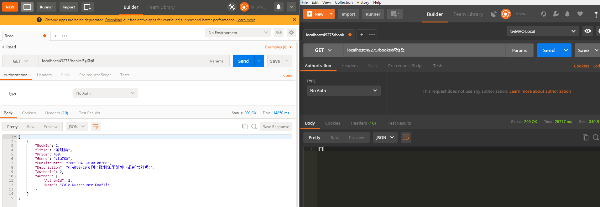
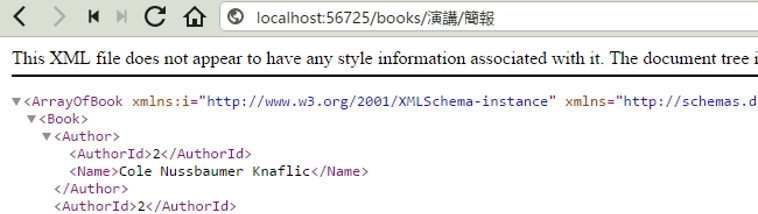

# Homework

### 屬性路由

> 注意，"Lab:屬性路由"的請求，拿到空字串或無回傳值就不算完成。每個請求應該有正確的回傳值。

1. 請想辦法正確存取此資源：

```
localhost:{port}/books/經濟學
```

不正常：

- Fiddler
- Postman for Windows

正常：

- Postman for Chrome
- Microsoft Edge
- IE 11 (Windows 10)
- Chrome
- Firefox



左邊是 Chrome 版 Postman 請求正常。
右邊是 Windows 版 Postman 請求不正常，請想辦法找出不正常的原因。

2. 請想辦法正確存取此資源：

```
localhost:{port}/books/演講/簡報
```

成功範例畫面：



### 完成實作

- Lab-Model-Dapper.md